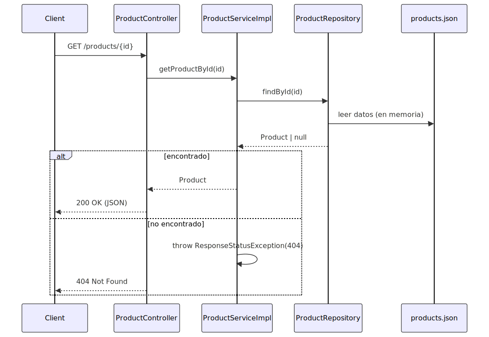

# Prueba Técnica MELI – Item API

Autor
- Verbo Julian Camacho

Versión
- 0.1.0 (inicial)

## Descripción
API backend que expone información de productos (inspirada en una página de detalle tipo MercadoLibre).  
La persistencia se realiza en archivo JSON local, sin base de datos.

## Stack
- Java 17
- Spring Boot 3.3.x
- spring-boot-starter-web
- springdoc-openapi-starter-webmvc-ui (Swagger UI)

## Arquitectura
- Capas:
  - Controller: expone endpoints REST (GET `/v1/products`, GET `/v1/products/{id}`)
  - Service: lógica de negocio mínima (404 si no existe el producto)
  - Repository: carga datos desde `src/main/resources/products.json`
- Flujo: `Controller → Service → Repository → products.json`

## Diagramas
Para mayor claridad se incluyen los siguientes diagramas en el directorio `docs/`:
- **Diagrama de clases**  
  

- **Diagrama de secuencia**  
  

## Endpoints
- `GET /v1/products`
  - Descripción: retorna todos los productos.
  - Respuesta: `200 OK` (array de `Product`)
- `GET /v1/products/{id}`
  - Descripción: retorna el producto con el id especificado.
  - Respuestas:
    - `200 OK` (`Product`)
    - `404 Not Found` si no existe (ResponseStatusException)

## Documentación OpenAPI
- Swagger UI: http://localhost:8080/swagger-ui/index.html
- OpenAPI JSON: http://localhost:8080/v3/api-docs

## Modelos
- `Product` (y otros modelos relacionados si aplica: `GeneralInfo`, `Characteristics`, `Reviews`)
- Los campos están documentados con anotaciones `@Schema`.

## Manejo de errores
- No encontrado: se lanza `org.springframework.web.server.ResponseStatusException` con estado `404`.
- Errores no controlados: Spring devolverá `500 Internal Server Error`.

## Configuración
- Puerto por defecto: `8080`
- Datos: archivo `src/main/resources/products.json`

## Requisitos previos
- Java 17
- Maven 3.9.x o superior
- Puerto `8080` libre

## Cómo ejecutar (resumen)
En el archivo `run.md` se encuentran los pasos para ejecutar este proyecto.

## Testing
- Ejecutar pruebas: `mvn test`
- Casos recomendados:
  - `GET /products` → 200
  - `GET /products/{id}` existente → 200
  - `GET /products/{id}` inexistente → 404

## Decisiones de diseño
- Sin base de datos (cumpliendo requerimiento): los datos provienen de JSON local.
- Separación por capas para facilitar mantenimiento y pruebas.

## Estrategia técnica
- **Stack elegido**: Spring Boot ofrece rapidez de desarrollo, integración con Swagger y manejo nativo de errores.
- **Persistencia en JSON**: se ajusta a los requisitos, evita complejidad innecesaria.
- **Uso de herramientas modernas**: Se usó ChatGPT y otras herramientas GenAI para asistencia en generación de código repetitivo, documentación y diagramas. Esto permitió reducir tiempos y enfocarse en la lógica de negocio.

## JavaDoc
Para generar la documentacion de JavaDoc corra el siguiente comando en una linea de comandos abierta en el directorio raiz del proyecto
    
    mvn javadoc:javadoc

Esto generara un archivo index.html en la ruta 

  - `target\reports\apidocs\index.html`

## prompts.md
En el archivo `prompts.md` se encuentran los prompts utilizados durante el desarrollo de esta prueba, para dar trazabilidad al uso de IA en el proceso.

